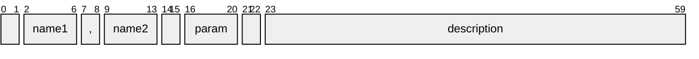
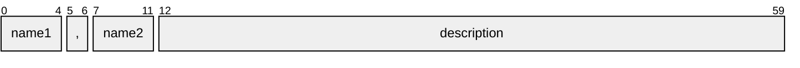

import HelpContent from './help-content.svg';

# Formatter

The `formatter` module handles formatting of help messages. It provides a function that accepts a set of option [definitions] and renders help messages in ANSI format. The messages produced by the formatter can also be customized via [message configuration].

## Help message

The result of formatting is a help message consisting of [ANSI strings], which may contain [escape sequences] and are meant to be printed in a terminal. Visually, it is composed of the following kinds of content:

- **entry** -- the text lines pertaining to a single option
- **item** -- a piece of information in an option description
- **group** -- a set of entries corresponding to an [option group]
- **section** -- like the section of a document (may be a collection of groups)
- **column** -- a horizontal division (as formed by a vertical ruler) across all entries in a section

This is better illustrated by the figure below:

<HelpContent style={{ maxWidth: '500', margin: '20px 20px 0px' }} />

### Obtaining a new message

To generate a help message, you must call the `format` function. It accepts the following parameters:

- `options` -- the option definitions (required)
- `sections` -- a list of [help sections] to include in the message (optional, defaults to a single [groups section])
- `flags` -- an object containing the [formatter flags] (optional)

It returns a [ANSI message] with the formatted sections.

## Formatter flags

The formatter procedure can be configured via a `FormatterFlags` object that has some optional properties, as described below.

### Program name

The `progName` property is the [program name] to display in [usage sections].

### Cluster prefix

The `clusterPrefix` property specifies the prefix for [cluster] arguments.

### Option filter

The `optionFilter` property specifies an [option filter] to select a subset of options.

## Help columns

Every option definition produces a help entry in its respective group in the help message. Furthermore, the whole set of entries across all groups in a section is split into "columns" (not to be confused with terminal columns), each containing a different kind of information, as described below.

### Names column

This column contains the options' names separated by commas (or by the value of the `optionSep` [connective word]). Names are listed in the order specified in the [option names] attribute.

#### Name slots

Depending on the [column alignment] setting, each option name may reserve a "slot" in the respective position in this column. The width of a slot will be the length of the _longest_ name in that slot, among all options. A `null{:ts}` value can be specified in order to skip the corresponding slot.

For example, if the option names are `'-f'{:ts}`, `null{:ts}` and `'--flag'{:ts}`, the resulting entry might be formatted as shown below. Note how the absent name produces whitespace between its neighbors:

```
-f,      --flag
```

> [!NOTE]
>
> Empty strings will also be suppressed, although they are recognized by the [parser].

> [!WARNING]
>
> You should generally avoid displaying names with spaces, as they will appear unquoted.

### Parameter column

This column is rendered according to the following rules:

1. If the option contains an [example value], render this value.
   - Else, if it contains a [parameter name], render this name.
   - Else, stop here and render nothing.
2. If it requires [inline parameters], prepend an equals sign `'='{:ts}`.
3. If it accepts multiple parameters or has an unknown [parameter count], append an ellipsis `'...'{:ts}`.
4. If it can be supplied without parameters, enclose the result in square brackets `'[]'{:ts}`.

The result might be something like `=<param>`, `[<param>...]` or `[...]`.

> [!WARNING]
>
> Displaying the parameter is especially important in [usage sections].

### Description column

The last column contains the option description and is composed of [help items].

## Help sections

Sections are a convenient way to organize the help content. There are three types of section: **text**, **usage** and **groups**. They are explained below.

### Common properties

All section types share a set of properties:

- `type` -- the type of section (required, can be `'text'{:ts}`, `'usage'{:ts}` or `'groups'{:ts}`)
- `heading` -- the section heading [text block] (optional, defaults to none)
- `content` -- the section content [text block] (optional, defaults to none)

> [!NOTE]
>
> If `content` is present and contains text, it will always include a _trailing_ line feed.

#### Text block

A text block contains the following optional properties:

- `text` -- the text (may contain inline styles, defaults to none)
- `style` -- the fallback style (defaults to none)
- `align` -- the text alignment (can be `'left'{:ts}` or `'right'{:ts}`, defaults to `'left'{:ts}`)
- `indent` -- the indentation level (defaults to `0{:ts}`)
- `breaks` -- the number of leading line feeds (defaults to `0{:ts}`)
- `noSplit` -- whether to disable [text splitting] (defaults to `false{:ts}`)
- `noBreakFirst` -- whether to avoid line feeds at the beginning of the message (defaults to `false{:ts}`)

The `noBreakFirst` is useful in two cases:

- in a **groups** section with many groups, to ensure that the first group heading will have no leading line feed; or
- when it is not known whether previous sections will have content (e.g., if the help can be invoked with an [option filter])

### Text section

A **text** section can be used to write various kinds of content, such as introduction, instructions, afterword, copyright notice or external references. It contains only the [common properties].

> [!TIP]
>
> You can create a personalized footer with the repository URL through the `sectionFooter` utility function.

### Usage section

The [usage message] (or usage statement) is a concise representation of the command-line structure. Here is an example:

{/* cSpell:disable */}

```ansi
  demo.js [-f|--no-flag]
          [(-sc|--strChoice) 'one' [(-b|--boolean) <param>]]
          [(-sr|--strRegex|-s) my str]
          [(-nr|--numRange|-n) my num]
          [(-nc|--numChoice)=1]
          [(-sa|--strArray) [<param>...]]
          [(-na|--numArray) [<param>...]]
          [--numArrayUnique ['1,2'...]]
          [--strArrayLimit|--] ['one'...]
```

{/* cSpell:enable */}

The `content.text` property of a **usage** section can be used to override the [program name]. In addition to the [common properties], this type of section has the following optional properties:

- `filter` -- a list of options to include or exclude (defaults to including all options)
- `exclude` -- whether the filter should exclude (defaults to `false{:ts}`)
- `required` -- a list of options that should be considered always required (defaults to none)
- `inclusive` -- a record that specifies [inclusive option dependencies] (defaults to none)
- `exclusive` -- reserved for mutually [exclusive option dependencies] (not yet implemented)
- `comment` -- a commentary to append to the usage (defaults to none)

> [!TIP]
>
> The `filter` property can be used to create multiple usages of the same command, with different options.

> [!NOTE]
>
> In the case of an inclusion filter, options are listed in the order specified in the filter. The exception is an option with a [positional marker], which comes _last_ in the usage.

#### Inclusive option dependencies

The `inclusive` property is equivalent to an adjacency list. Mutually dependent options and multi-targeting are supported. The following table lists some examples to illustrate this. Suppose we have options A, B and C. Then:

| Dependencies                       | Usage               | If C is always required |
| ---------------------------------- | ------------------- | ----------------------- |
| A requires B requires C            | `[C [B [A]]]`       | `C [B [A]]`             |
| A and B require each other         | `[A B] [C]`         | `C [A B]`               |
| A requires B requires C requires A | `[A B C]`           | `A B C`                 |
| A and C require B                  | `[B [A] [C]]`       | `B C [A]`               |
| C requires A requires B            | `[B [A [C]]]`       | `A B C`                 |
| A requires B and C                 | `[B] [C] [B C [A]]` | `C [B [A]]`             |

> [!WARNING]
>
> The order of options is unspecified when there are dependencies. However, a dependent option usually appears _after_ the one it depends on.

#### Exclusive option dependencies

The `exclusive` property is reserved for mutual exclusivity. This feature is _not_ supported at the time. For that purpose, you have to create different usages.

> [!NOTE]
>
> The reason is that there are many corner cases and it is tricky to implement. We sincerely apologize.

### Groups section

A **groups** section is a collection of option groups and their help entries. The [option group] attribute is used as a heading for each group, except for the _default_ group, which borrows the `heading.text` property, if present. The default group also includes the value of `content.text`, if present, as a preface before listing its entries.

In addition to the [common properties], this type of section has the following optional properties:

- `filter` -- a list of group names to include or exclude (defaults to including all groups)
- `exclude` -- whether the filter should exclude (defaults to `false{:ts}`)
- `layout` -- an object with [column layout] settings for the section (see below)
- `items` -- the (order of) [help items] to display in option descriptions (defaults to all items)
- `useEnv` -- whether option names should be replaced with [environment variable] names (defaults to `false{:ts}`)

> [!TIP]
>
> The `useEnv` property can be used to create a dedicated section for environment variables.

> [!NOTE]
>
> In the case of an inclusion filter, groups are listed in the order specified in the filter.

#### Column layout

The layout of a **groups** section can be configured via a partial `HelpColumnsLayout` object containing three properties: `names`, `param` and `descr`. Each of which can be used to customize the layout of the corresponding [help column] -- applied to all help entries in the section -- and contains the following optional settings:

- `align` -- text alignment for the column (can be `'left'{:ts}` or `'right'{:ts}`, defaults to `'left'{:ts}`)
- `indent` -- indentation level for the column (must be non-negative if `absolute` is `true{:ts}`, defaults to `2{:ts}`)
- `breaks` -- number of line feeds to insert before each entry at the start of the column (defaults to `0{:ts}`)
- `hidden` -- whether the column should be hidden (defaults to `false{:ts}`)
- `absolute` -- whether the indentation level should be relative to the terminal's left boundary instead of the end of the previous column (not available for the `names` column, defaults to `false{:ts}`)

Here's a graph showing a single help entry with default layout in a terminal with 60-character width:



And here's a layout where we eliminate the `names` indentation, hide the `param` column and merge with `descr`:



##### Column alignment

The `names.align` property supports an additional value `'slot'{:ts}`, meaning that each name reserves a "slot" in the column, and the name is left-aligned within that slot. (See [name slots] for more information.)

The `param.align` and `descr.align` properties support an additional value `'merge'{:ts}`, which instructs the formatter to merge the contents of the column with the previous one. This is useful, for instance, if you want option parameters to be inlined with option names. When using this value, both the `indent` and `breaks` properties are ignored.

> [!NOTE]
>
> If either `param.align` is set to `'merge'{:ts}` or if `param.hidden{:ts}` is `true{:ts}` and `descr.align{:ts}` is set to `'merge'{:ts}`, then the `'slot'{:ts}` setting for `names.align` will be ignored.

Note that merging a column is not the same as using zero indentation. Indentation is always relative to the end of the previous column, which depends on the length of the _longest_ text in that column, across all entries. On the other hand, merging implies having no additional space between text in both columns.

##### Layout example

An example can better illustrate the effect of some of the layout settings. Suppose we have:

```ts twoslash
import type { WithSectionGroups } from 'tsargp';
// ---cut---
const layout: WithSectionGroups['layout'] = {
  names: {
    align: 'slot', // assign a slot to each option name
  },
  param: {
    breaks: 1, // break option parameters
    indent: -10, // recede 10 terminal columns from the end of the names column
  },
  descr: {
    align: 'right', // align option descriptions to the right
    breaks: 1, // break option descriptions
    indent: 20, // indent 20 terminal columns
    absolute: true, // ...from the beginning of the line
  },
};
```

Below is an excerpt of a help message produced with the above configuration, in a terminal with 60-character width:

{/* cSpell:disable */}

```ansi
  -nc,   --numChoice
          1
                      A number option. Values must be one of
                                                     {1, 2}.
  -nums, --numbers
          [<param>...]
                     A number array option. Accepts multiple
                             parameters. Defaults to [1, 2].
```

{/* cSpell:enable */}

#### Help items

The `items` property of a **groups** section specifies the kinds of help items that should be displayed in option descriptions, and in which order. It is an array whose values can be one of the enumerators from `HelpItem`. The default is to print all items as they are listed in the enumeration type.

> [!TIP]
>
> You might want to use this to limit the amount of information in the help message.

## Option filter

The `filter` parameter of the `format` function lists patterns that will be searched for in option [definitions], to filter the options. The patterns are case-insensitive and match [option names], [synopsis] and [environment variable] names. If multiple patterns are provided, any matched one will suffice to include an option in the message.

> [!NOTE]
>
> This is inherently different from what a text search utility like GNU's `grep` would produce. The formatter will render the whole _help entry_ of options matching the given patterns, not just the matching _lines_.

{/* self references */}

[^1]: _polyadic_ means that the option accepts more than one parameter, but the parameter count is not variable

[groups section]: #groups-section
[usage sections]: #usage-section
[option filter]: #option-filter
[help sections]: #help-sections
[help column]: #help-columns
[custom phrases]: #custom-phrases
[column layout]: #column-layout
[column alignment]: #column-alignment
[help items]: #help-items
[name slots]: #name-slots
[common properties]: #common-properties
[text block]: #text-block
[formatter flags]: #formatter-flags
[inclusive option dependencies]: #inclusive-option-dependencies
[exclusive option dependencies]: #exclusive-option-dependencies

{/* options references */}

[definitions]: options#option-definition
[synopsis]: options#option-synopsis
[environment variable]: options#data-sources
[option group]: options#group--hide
[option names]: options#option-names
[positional marker]: options#positional--marker
[example value]: options#example-value
[parameter name]: options#parameter-name
[niladic]: options#option-parameters
[subcommand]: options#command-option
[parameter count]: options#parameter-count

{/* parser references */}

[parser]: parser
[inline parameters]: parser#inline-parameters
[program name]: parser#program-name
[cluster]: parser#cluster-prefix

{/* styles references */}

[ANSI strings]: styles#ansi-string
[ANSI message]: styles#ansi-message
[text formatting]: styles#text-splitting
[message configuration]: styles#message-configuration
[inline styles]: styles#inline-styles
[connective word]: styles#connective-words
[text splitting]: styles#text-splitting

{/* external references */}

[escape sequences]: https://en.wikipedia.org/wiki/ANSI_escape_code
[usage message]: https://en.wikipedia.org/wiki/Usage_message
