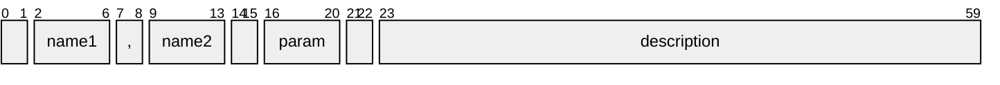
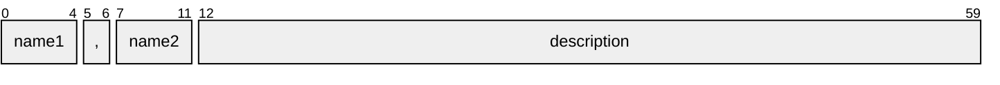

import HelpContent from './help-content.svg';

# Formatter

The `formatter` module handles formatting of help messages. It provides a function that accepts a set of option [definitions] and renders help messages in ANSI format. The messages produced by the formatter can also be customized via [message configuration].

## Help message

The result of formatting is a help message consisting of [ANSI strings], which may contain [escape sequences] and are meant to be printed in a terminal. Visually, it is composed of the following kinds of content:

- **entry** -- the text lines pertaining to a single option
- **item** -- a piece of information in an option description
- **group** -- a set of entries corresponding to an [option group]
- **section** -- like the section of a document (may be a collection of groups)
- **column** -- a horizontal division (as formed by a vertical ruler) across all entries in a section

This is better illustrated by the figure below:

<HelpContent style={{ maxWidth: '500', margin: '20px 20px 0px' }} />

### Obtaining a new message

To generate a help message, you must call the `format` function. It accepts the following parameters:

- `options` -- the option [definitions] (required)
- `sections` -- a list of [help sections] to include in the message (optional, defaults to a single [groups section])
- `flags` -- an object containing the [formatter flags] (optional)

It returns a [ANSI message] with the formatted sections.

## Formatter flags

The formatter procedure can be configured via a `FormatterFlags` object that has some optional properties, as described below.

### Program name

The `programName` property is the [program name] to display in [usage sections]. If not present or empty, usage statements will contain no program name.

### Cluster prefix

The `clusterPrefix` property specifies the prefix for [cluster arguments]. If not present, [cluster letters] will not appear in usage statements.

### Option filter

The `optionFilter` property specifies a list of patterns to select a subset of options. If not present, all options will be included respecting the order of their [definitions].

The patterns are case-insensitive and match [option names], [synopsis] and [environment variable] names. If multiple patterns are provided, any matched one will suffice to include an option in the message.

> [!NOTE]
>
> This is inherently different from what a text search utility like GNU's `grep` would produce. The formatter will render the whole _help entry_ of options matching the given patterns, not just the matching _lines_.

### Standard input symbol

The `stdinSymbol` property specifies a symbol for the [standard input] to display in [usage sections]. If not present, the standard input will not appear in usage statements.

### Positional marker

The `positionalMarker` attribute, if present, specifies the marker(s) to delimit positional arguments. If not present, no marker will appear in usage statements.

## Help columns

Every option definition produces a help entry in its respective group in the help message. Furthermore, the whole set of entries across all groups in a section is split into "columns" (not to be confused with terminal columns), each containing a different kind of information, as described below.

### Names column

The first column contains the option names separated by the value of the `optionSep` [connective word]. Names are listed in the order specified in the [option names] attribute.

> [!WARNING]
>
> You should generally avoid displaying names with spaces, as they will appear unquoted.

#### Name slots

Depending on the column's [common settings], each option name may reserve a "slot" in the respective position in this column. The width of a slot will be the length of the _longest_ name in that slot, among all options. A `null{:ts}` value can be specified in order to skip the corresponding slot.

For example, if the option names are `'-f'{:ts}`, `null{:ts}` and `'--flag'{:ts}`, the resulting entry might be formatted as shown below. Note how the absent name produces whitespace between its neighbors:

```
-f,      --flag
```

### Parameter column

The second column contains the option parameter(s). It is rendered according to [parameter rules].

> [!WARNING]
>
> Displaying the option parameter is especially important in [usage sections].

#### Parameter rules

1. If the option contains an [example value], render this value.
   - Else, if it contains a [parameter name], render this name.
   - Else, stop here and render nothing.
2. If it requires [inline parameters], prepend an equals sign `'='{:ts}`.
   - Else, if it accepts infinite or unknown number of parameters, append an ellipsis `'...'{:ts}`.
3. If it can be supplied without parameters, enclose the result in square brackets `'[]'{:ts}`.

The result might be something like `=<param>`, `[<param>...]` or `[...]`.

> [!TIP]
>
> To display multiple parameters for a polyadic [function] option, you can use an array [example value] or a [parameter name] with multiple parameters (e.g., `<param1> [<param2>]`).

### Description column

The last column contains the option description, which is composed of [help items].

#### Help items

The `items` property of a [groups section] specifies the kinds of help items that should be displayed in option descriptions, and in which order. It is an array whose values can be one of the enumerators from `HelpItem`. The default is to print all items as they are listed in the enumeration type.

> [!TIP]
>
> You might want to use this to limit the amount of information in the help message.

## Help sections

Sections are a convenient way to organize the help content. There are three types of section: **text**, **usage** and **groups**. They are explained in the next subsections.

### Shared properties

Before describing the section types themselves, it should be noted that some sections may share sets of common properties, as listed below.

#### Basic properties

All section types share a set of properties:

- `type` -- the type of section (required, can be `'text'{:ts}`, `'usage'{:ts}` or `'groups'{:ts}`)
- `heading` -- the section heading [text block] (optional, defaults to none)
- `content` -- the section content [text block] (optional, defaults to none)

> [!NOTE]
>
> If `content` is present and contains text, it will always include a _trailing_ line feed.

#### Text block

A `HelpTextBlock` object contains the following optional properties:

- `text` -- the plain or styled text (defaults to none)
- `style` -- the fallback style (defaults to none)
- `align` -- the text alignment (can be `'left'{:ts}` or `'right'{:ts}`, defaults to `'left'{:ts}`)
- `indent` -- the indentation level (defaults to `0{:ts}`)
- `breaks` -- the number of leading line feeds (defaults to `0{:ts}`)
- `noSplit` -- whether to disable [text splitting] (defaults to `false{:ts}`)
- `noBreakFirst` -- whether to avoid line feeds at the beginning of the message (defaults to `false{:ts}`)

The `noBreakFirst` is useful in two cases:

- in a **groups** section with many groups, to ensure that the first group heading will have no leading line feed; or
- when it is not known whether previous sections will have content (e.g., if the help can be invoked with an [option filter])

#### Section filter

A `HelpSectionFilter` object contains the following optional properties:

- `includeOptions` -- a list of option keys to include (defaults to including all)
- `includeGroups` -- a list of group names to include (defaults to including all)
- `excludeOptions` -- a list of option keys to exclude (defaults to excluding none)
- `excludeGroups` -- a list of group names to exclude (defaults to excluding none)

> [!TIP]
>
> These properties can be used to create multiple usages of the same command.

> [!NOTE]
>
> Matches are exact. Exclusion properties have precedence over inclusion ones. Options and groups are listed in order of their [definitions].

### Text section

A **text** section can be used to write various kinds of content, such as introduction, instructions, afterword, copyright notice or external references. It contains only the [basic properties].

> [!TIP]
>
> You can create a personalized footer including the repository URL through the `sectionFooter` function.

### Usage section

The [usage statement] is a concise representation of the command-line structure. Here is an example:

{/* cSpell:disable */}

```ansi
tsargp [-f|--no-flag]
       [(-sc|--strChoice) 'one' [(-b|--boolean) <param>]]
       [(-sr|--strRegex|-s) my str]
       [(-nr|--numRange|-n) my num]
       [(-nc|--numChoice)=1]
       [(-sa|--strArray|-S) [<str>...]|-]
       [(-na|--numArray|-N) [<num>...]]
       [--strArrayLimit] ['one'...]
       [--numArrayUnique ['1,2'...]]
       [-- [...]]
```

{/* cSpell:enable */}

Option parameters are rendered similarly to the [parameter column], except that [parameter name] attributes are given priority over [example value]. Also, the `content.text` property can be used to override the [program name].

In addition to the [basic properties], a **usage** section has the following optional properties:

- `filter` -- the [section filter]
- `required` -- a list of options that should be considered always required (defaults to none)
- `inclusive` -- a record that specifies inclusive [option dependencies] (defaults to none)
- `exclusive` -- reserved for mutually exclusive [option dependencies] (not yet implemented)
- `comment` -- a commentary to append to the usage (defaults to none)
- `compact` -- whether to keep alternatives compact (defaults to `true{:ts}`)
- `showMarker` -- whether to display the [positional marker] (defaults to `false{:ts}`)

#### Option dependencies

The `inclusive` property of a **usage** section is equivalent to an adjacency list. Mutually dependent options and multi-targeting are supported. The following table lists some examples to illustrate this. Suppose we have options A, B and C. Then:

| Dependencies                       | Usage               | If C is always required |
| ---------------------------------- | ------------------- | ----------------------- |
| A requires B requires C            | `[C [B [A]]]`       | `C [B [A]]`             |
| A and B require each other         | `[A B] [C]`         | `C [A B]`               |
| A requires B requires C requires A | `[A B C]`           | `A B C`                 |
| A and C require B                  | `[B [A] [C]]`       | `B C [A]`               |
| C requires A requires B            | `[B [A [C]]]`       | `A B C`                 |
| A requires B and C                 | `[B] [C] [B C [A]]` | `C [B [A]]`             |

> [!WARNING]
>
> The order of options is unspecified when there are dependencies, although a dependent option will usually appear _after_ the one it depends on.

The `exclusive` property of a **usage** section is reserved for mutual exclusivity. This feature is _not_ supported at the time. For that purpose, you have to create different usages -- we sincerely apologize.

The kinds of dependencies that cannot currently be expressed are:

| Dependencies                        | Usage                          | If C is always required |
| ----------------------------------- | ------------------------------ | ----------------------- |
| A requires B _or_ C (or both)       | `[B [A]] [C [A]] [B C [A]]`    | `C [A] [B]`             |
| A requires B _or_ C, _but not_ both | `[B [A] \| C [A] \| B C]`      | `C [A \| B]`            |
| A requires _not_ B                  | `[A \| B] [C]`                 | `C [A \| B]`            |
| A requires _not_ B _and not_ C      | `[A \| [B] [C]]`               | `C [B]`                 |
| A requires _not_ B _or not_ C       | `[A \| A B \| A C \| [B] [C]]` | `C [A \| B]`            |

### Groups section

A **groups** section is a collection of option groups and their help entries. The [option group] attribute is used as a heading for each group, except for the _default_ group, which borrows the `heading.text` property, if present. The default group also includes the value of `content.text`, if present, as a preface before listing its entries.

In addition to the [basic properties], this type of section has the following optional properties:

- `filter` -- the [section filter]
- `layout` -- the section [help layout]
- `useEnv` -- whether option names should be replaced with [environment variable] names (defaults to `false{:ts}`)

> [!TIP]
>
> The `useEnv` property can be used to create a dedicated section for environment variables.

## Help layout

The layout of a **groups** section can be configured via a `HelpLayout` object with the following optional properties:

- `names` -- the [column layout] of the [names column]
- `param` -- the [column layout] of the [parameter column]
- `descr` -- the [column layout] of the [description column]
- `items` -- the (order of) [help items] to display in option descriptions (defaults to all items)
- `responsive` -- whether the layout is responsive (a.k.a., terminal-aware) (defaults to `true{:ts}`)

When the `responsive` property is set to `false{:ts}`, the terminal width is ignored and text is wrapped in [line-wise] mode. In this mode, lines are continued from one column to the next, allowing a column to "break" its lines independently of other columns. In this case, the `maxWidth` property should be set on the column's [common settings].

> [!TIP]
>
> These settings can also be overridden for each help entry. See the option's [layout] attribute.

### Column layout

The layout of a [help column] applies to all help entries within the containing section. The available settings are described below.

> [!TIP]
>
> To hide a column from the help message, set its layout to `null{:ts}`.

#### Common settings

All help columns share a set of optional layout settings:

- `align` -- the type of text alignment (can be `'left'{:ts}` or `'right'{:ts}`, defaults to `'left'{:ts}`)
- `indent` -- the column indentation level (defaults to `2{:ts}`)
- `breaks` -- the number of line feeds to insert before each entry at the start of the column (defaults to `0{:ts}`)
- `maxWidth` -- the maximum column or slot width (defaults to `Infinity{:ts}`)

#### Specific settings

Some help columns may have additional layout settings:

- `slotIndent` -- the slot indentation level, or zero or `NaN{:ts}` to disable slots (defaults to `0{:ts}`)
- `absolute` -- whether `indent` should be relative to the beginning of the line (defaults to `false{:ts}`)
- `merge` -- whether to merge the contents of the column with the previous one (defaults to `false{:ts}`)

The `slotIndent` setting is currently only available for the [names column]. It causes each name to reserve a "slot" in the column, and the name will be aligned within that slot. (See [name slots] for more information.)

> [!NOTE]
>
> The `slotIndent` setting does not apply to the _first_ slot, and is ignored when the column is merged.

The `absolute` and `merge` settings only apply to the other columns.

The `merge` setting is useful, for instance, if you want option parameters to be inlined with option names. Note that merging a column is not the same as using zero indentation. The indentation is always relative to the end of the previous column, which depends on the length of the _longest_ text in that column, across all help entries. On the other hand, merging implies having no additional space between text in both columns.

> [!NOTE]
>
> When merging columns, text alignment and indentation will be that of the last previous non-merged column.

### Layout examples

Here's a graph showing a single help entry with default layout in a terminal with 60-character width:



And here's a layout where we eliminate the `names` indentation, hide the `param` column and merge with `descr`:



A real example can better illustrate the effect of some of the layout settings. Suppose we have:

```ts twoslash
import type { WithSectionGroups } from 'tsargp';
// ---cut---
const layout: WithSectionGroups = {
  names: {
    slotIndent: 1, // assign a slot to each option name, with a single space between slots
  },
  param: {
    breaks: 1, // break option parameters
    indent: -10, // recede 10 terminal columns from the end of the names column
  },
  descr: {
    align: 'right', // align option descriptions to the right
    breaks: 1, // break option descriptions
    indent: 20, // indent 20 terminal columns
    absolute: true, // ...from the beginning of the line
  },
};
```

Below is an excerpt of a help message produced with the above configuration:

{/* cSpell:disable */}

```ansi
  -nc,   --numChoice
          1
                      A number option. Values must be one of
                                                     {1, 2}.
  -nums, --numbers
          [<param>...]
                     A number array option. Accepts multiple
                             parameters. Defaults to [1, 2].
```

{/* cSpell:enable */}

Here's an excerpt of a help message produced with non-responsive layout, with right-aligned columns:

{/* cSpell:disable */}

```ansi
       -s,       <param>  A single option with
  --single                       big synopsis.
       -a,      [<param>      Accepts multiple
   --array   <param>...]           parameters.
```

{/* cSpell:enable */}

{/* self references */}

[groups section]: #groups-section
[usage sections]: #usage-section
[option filter]: #option-filter
[help sections]: #help-sections
[help column]: #help-columns
[custom phrases]: #custom-phrases
[help layout]: #help-layout
[column layout]: #column-layout
[common settings]: #common-settings
[help items]: #help-items
[name slots]: #name-slots
[basic properties]: #basic-properties
[section filter]: #section-filter
[text block]: #text-block
[formatter flags]: #formatter-flags
[option dependencies]: #option-dependencies
[names column]: #names-column
[parameter column]: #parameter-column
[description column]: #description-column
[parameter rules]: #parameter-rules

{/* options references */}

[definitions]: options#option-definition
[synopsis]: options#option-synopsis
[environment variable]: options#data-sources
[option group]: options#group--hide
[option names]: options#option-names
[positional marker]: options#positional-marker
[example value]: options#example-value
[parameter name]: options#parameter-name
[niladic]: options#option-parameters
[subcommand]: options#command-option
[standard input]: options#standard-input
[cluster letters]: options#cluster-letters
[function]: options#function-option
[layout]: options#layout-settings

{/* parser references */}

[parser]: parser
[inline parameters]: parser#inline-parameters
[program name]: parser#program-name
[cluster arguments]: parser#cluster-prefix

{/* styles references */}

[ANSI strings]: styles#ansi-string
[ANSI message]: styles#ansi-message
[text formatting]: styles#text-splitting
[message configuration]: styles#message-configuration
[line-wise]: styles#line-wise-wrapping
[connective word]: styles#connective-words
[text splitting]: styles#text-splitting

{/* external references */}

[escape sequences]: https://en.wikipedia.org/wiki/ANSI_escape_code
[usage statement]: https://en.wikipedia.org/wiki/Usage_message
