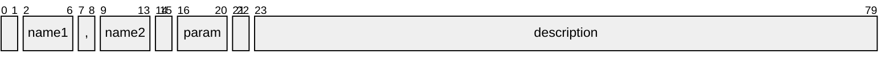
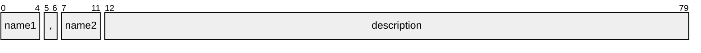

import HelpContent from './help-content.svg';
import { Callout } from 'nextra/components';

# Formatter

The `HelpFormatter` component handles formatting of help messages. It can be instantiated with a set of option definitions and provides methods to render help messages in ANSI format.

<Callout type="info">

Messages produced by the formatter can be customized via [message configuration].

</Callout>

## Help message

Internally, the help message consists of [ANSI strings], which may contain escape sequences and are meant to be printed in a terminal. Visually, it is composed of the following kinds of content:

- **entry** - the text lines pertaining to a single option
- **item** - a piece of information in an option's description
- **group** - a set of entries corresponding to an [option group]
- **section** - like the section of a document (may be a collection of groups)
- **column** - a horizontal division (as formed by a vertical ruler) across all entries

This is better illustrated by the figure below:

<HelpContent style={{ maxWidth: '500', margin: '20px 20px 0px' }} />

There are two ways of obtaining help messages, as described below.

### Grouped help

The `format` method returns the help message of an [option group]. It accepts a single optional parameter: the name of the group. If not provided, the _default_ group will be used, which encompasses all options that did not explicitly declare a group in their definition.

### Sectioned help

The `sections` method returns a help message that includes [help sections]. It accepts two parameters:

- `sections` - a list of `HelpSection`s to include in the help message
- `progName` - an optional program name to display in usage sections

## Help columns

Every option definition produces a help entry in its respective group in the help message. Furthermore, the whole set of entries across all groups is split into "columns" (not to be confused with terminal columns), each containing a different kind of information, as described below.

### Names column

This column contains the options' names separated by commas. The names are listed in the same order as was specified in the [names] attribute.

#### Name slots

Depending on the column's [alignment] setting, each option name may reserve a "slot" in the respective position in this column. The width of a name slot will be the length of the longest name in that slot, among all options. Empty strings or `null{:ts}`s can be specified in order to skip a slot.

For example, if an option's names are `'-f'{:ts}`, `'-ff'{:ts}`, `''{:ts}` and `'--flag'{:ts}`, the resulting entry might be formatted as:

```
-f, -ff      --flag
```

Note how the empty string produced whitespace between its neighbors, and the commas were suppressed.

### Parameter column

This column is rendered according to the following rules:

- if the option is [niladic], do nothing
- else, if it is a [subcommand], render an ellipsis `'...'{:ts}`
- else, if it contains an [example value], render this value
  - and, if it requires [inline parameters], prepend an equals sign `'='{:ts}`
  - else, if it accepts multiple parameters, append an ellipsis `'...'{:ts}`
- otherwise
  - do this
    - if it contains a [parameter name], render this name
    - else, render the word `'param'{:ts}`
  - and enclose the result in angle brackets `'<>'{:ts}` (if not already)
  - and,
    - if it requires [inline parameters], prepend an equals sign `'='{:ts}`
    - else, if it accepts multiple parameters, append an ellipsis `'...'{:ts}`
  - and, if it can be specified without parameters, enclose the result in square brackets `'[]'{:ts}`

The result might be something like `=<param>` or `[<param>...]`.

### Description column

The last column contains the option description and is composed of [help items].

## Help sections

Sections are a convenient way to organize the help content. There are three kinds of help sections: **text**, **usage** and **groups**. They are explained below.

### Common properties

All help sections share a set of properties:

- `title` - the section heading or the default [option group] heading (defaults to none)
- `style` - the style of the section heading or [option group] headings (defaults to `tf.bold{:ts}`)
- `breaks` - the number of line breaks to insert before the section (defaults to `0{:ts}` for the first section, `2{:ts}` for others)
- `noWrap` - true to disable wrapping of provided texts (defaults to `false{:ts}`)

<Callout type="info">

Even if `noWrap` is set, inline styles may still be used in text properties, although they will _not_ be formatted according to the [text formatting] rules.

</Callout>

<Callout type="info">

All headings are separated from their content by _two_ line feeds, unless extra spacing is provided in heading texts. For the sake of simplicity, there is no way to configure this behavior.

</Callout>

### Text section

A text section can be used to write many kinds of content, such as an introductory text, usage instructions, afterword, copyright notice or external references. In addition to the [common properties], it has the following properties:

- `text` - the section content
- `indent` - the level of indentation of the section content (defaults to `0{:ts}`)

### Usage section

The usage text is a concise representation of a program's command-line. Here is an example:

{/* cSpell:disable */}

```ansi
demo.js [(-h|--help)] [(-v|--version)] # get help
demo.js hello ... # execute the hello command
demo.js [(-f|--flag|--no-flag)]
        [(-b|--boolean) <boolean>]
        [(-s|--stringRegex) <my str>]
        [(-n|--numberRange) <my num>]
        [(-se|--stringEnum) 'one']
        [(-ne|--numberEnum) 1]
        [(-ss|--strings) [<strings>]]
        [(-ns|--numbers) <numbers>...]
        [[(--stringsEnum|--)] 'one' 'two']
        [--numbersEnum '1,2']
```

{/* cSpell:enable */}

In addition to the [common properties], a usage section has the following properties:

- `indent` - the level of indentation of the section content (defaults to `0{:ts}`)
- `filter` - a list of option keys to include or exclude (defaults to including all options)
- `exclude` - whether the filter should exclude (defaults to `false{:ts}`)
- `required` - a list of options that should be considered _always_ required
- `requires` - a map of option keys to required options (defaults to none)
- `comment` - a commentary to append to the usage (defaults to none)

<Callout type="default">

The filter can be used to create multiple usages of the same command, with different options.

</Callout>

<Callout type="info">

In the case of an inclusion filter, options are listed in the same order specified in the filter.

</Callout>

#### Option dependencies

The `requires` property is equivalent to an adjacency list, except that each source can only reference a single target. Mutually dependent options are supported. The following table lists some examples that illustrate how this works. Suppose we have options A, B and C. Then:

| Dependencies                       | Usage         | If C is always required |
| ---------------------------------- | ------------- | ----------------------- |
| A requires B requires C            | `[[[A] B] C]` | `[[A] B] C`             |
| A and B require each other         | `[A B] [C]`   | `[A B] C`               |
| A requires B requires C requires A | `[A B C]`     | `A B C`                 |
| A and C require B                  | `[[A] B [C]]` | `[A] B C`               |
| A requires B; C requires A         | `[[A [C]] B]` | `A C B`                 |

<Callout type="info">

Mutual exclusivity and multi-targeting are _not_ supported at this time. For that purpose, you have to create different usages. (The reason is that it is difficult to implement. We sincerely apologize.)

</Callout>

### Groups section

A groups section is a collection of option groups and their help entries. In addition to the [common properties], it has the following properties:

- `filter` - a list of group names to include or exclude (defaults to including all groups)
- `exclude` - whether the filter should exclude (defaults to `false{:ts}`)

<Callout type="info">

In the case of an inclusion filter, groups are listed in the same order specified in the filter.

</Callout>

## Help layout

The layout of the help message can be configured via a `PartialHelpLayout` object, which can be provided as the second parameter to the formatter constructor. It contains the optional properties described below.

### Column layout

The `names`, `param` and `descr` properties can be used to customize the layout of the corresponding [help column] (applied to all help entries). They are objects with the following optional settings:

- `align` - text alignment for the column (may be one of `'left'{:ts}` or `'right'{:ts}`, defaults to `'left'{:ts}`)
- `indent` - level of indentation for the column (must be non-negative if `absolute` is `true{:ts}`, defaults to `2{:ts}`)
- `breaks` - number of line breaks to insert before each entry in the column (defaults to `0{:ts}`)
- `hidden` - whether the column should be hidden (defaults to `false{:ts}`)
- `absolute` - whether the indentation level should be relative to the beginning of the line instead of the end of the previous column (not available for the `names` column, defaults to `false{:ts}`)

Here's a graph showing a single help entry with default layout in a terminal with 80-character width:



And here's a layout where we eliminate the `names` indentation, suppress the `param` column and merge with `descr`:



The `names.align` property supports an additional value `'slot'{:ts}`, meaning that each name receives a "slot" in the column, and the name is left-aligned within that slot. See [name slots] for more information.

The `param.align` and `descr.align` properties support an additional value `'merge'{:ts}`, which instructs the formatter to merge the contents of the column with the previous one. This is useful, for instance, if you want option parameters to be inlined with option names. When using this value, both the `indent` and `breaks` properties are ignored.

<Callout type="info">

Note that merging a column is not the same as using zero indentation. Indentation is always relative to the end of the previous column, which depends on the length of the _longest_ text in that column, across all entries. On the other hand, merging implies having no additional space between text in both columns.

</Callout>

An additional example can better illustrate the effect of some of these settings. Suppose we have:

```ts
{
  names: {
    align: 'slot',  // assign a slot to each option name
  },
  param: {
    breaks: 1,      // break option parameters
    indent: -10,    // recede 10 terminal columns from the end of the names column
  },
  descr: {
    align: 'right', // align option descriptions to the right
    breaks: 1,      // break option descriptions
    indent: 20,     // indent 20 terminal columns
    absolute: true, // ...from the beginning of the line
  }
}
```

Below is an extract of a help message produced with the above configuration:

{/* cSpell:disable */}

```ansi
  -ne,   --numberEnum
            1
                             A number option. Values must be one of {1, 2}.
  -ns,   --numbers
            [<param>...]
                      A numbers option. Accepts multiple parameters. Values
                    must be in the range [0, Infinity]. Defaults to [1, 2].
```

{/* cSpell:enable */}

### Help items

The `items` property specifies the kinds of help items that should be displayed in option descriptions, and in which order. It is an array whose values can be one of the enumerators from `HelpItem`. The default is to print all items in the order listed in the enumerator type.

<Callout type="default">

You might want to use this to limit the amount of information in the help message.

</Callout>

## Option filter

The formatter constructor accepts a third optional parameter: a list of patterns that indicate which options should be rendered in the help message. The filter matches options' names, synopsis and environment data sources. If multiple patterns are provided, any matched one will suffice to include an option in the message.

<Callout type="info">

This is inherently different from what a text search utility like `grep` would produce. The formatter will render the whole help _entry_ of options matching the given patterns, not just the matching _lines_.

</Callout>

{/* self references */}

[^1]: _polyadic_ means that the option accepts more than one parameter, but the parameter count is not variable

[help sections]: #help-sections
[help column]: #help-columns
[custom phrases]: #custom-phrases
[alignment]: #help-layout
[help items]: #help-items
[name slots]: #name-slots
[common properties]: #common-properties

{/* options references */}

[option group]: options#group--hide
[names]: options#option-names
[example value]: options#example-value
[parameter name]: options#parameter-name
[niladic]: options#niladic-options
[subcommand]: options#command-option

{/* parser references */}

[inline parameters]: parser#inline-parameters

{/* styles references */}

[ANSI strings]: styles#ansi-string
[text formatting]: styles#text-splitting
[message configuration]: styles#message-configuration
