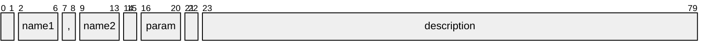
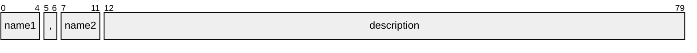

import HelpContent from './help-content.svg';
import { Callout } from 'nextra/components';

# Formatter

The `formatter` module handles formatting of help messages. It provides functions that accept a set of option definitions and render help messages in ANSI format. The messages produced by the formatter can also be customized via [message configuration].

## Help message

Internally, the help message consists of [ANSI strings], which may contain escape sequences and are meant to be printed in a terminal. Visually, it is composed of the following kinds of content:

- **entry** - the text lines pertaining to a single option
- **item** - a piece of information in an option's description
- **group** - a set of entries corresponding to an [option group]
- **section** - like the section of a document (may be a collection of groups)
- **column** - a horizontal division (as formed by a vertical ruler) across all entries in a section

This is better illustrated by the figure below:

<HelpContent style={{ maxWidth: '500', margin: '20px 20px 0px' }} />

To generate a help message, you must call the `format` function. It accepts the following parameters:

- `options` - the option definitions (required)
- `sections` - a list of [help sections] to include in the help message (optional, defaults to a single [groups section])
- `filter` - an [option filter] to select a subset of options (optional, defaults to none)
- `progName` - a program name to display in usage sections (optional, defaults to none)

It returns a [ANSI message] with the formatted sections.

### Option filter

The `filter` parameter to the `format` function lists patterns that indicate which options should be rendered in the help message. It matches options' [names], [synopsis] and environment [data sources]. If multiple patterns are provided, any matched one will suffice to include an option in the message.

<Callout type="info">

This is inherently different from what a text search utility like `grep` would produce. The formatter will render the whole _help entry_ of options matching the given patterns, not just the matching _lines_.

</Callout>

## Help columns

Every option definition produces a help entry in its respective group in the help message. Furthermore, the whole set of entries across all groups in a section is split into "columns" (not to be confused with terminal columns), each containing a different kind of information, as described below.

### Names column

This column contains the options' names separated by commas. The names are listed in the same order as was specified in the [names] attribute. The [positional] marker, if present, is appended to this list.

#### Name slots

Depending on the [column alignment] setting, each option name may reserve a "slot" in the respective position in this column. The width of a name slot will be the length of the longest name in that slot, among all options. A `null{:ts}` value can be specified in order to skip the corresponding slot.

For example, if an option's names are `'-f'{:ts}`, `'-ff'{:ts}`, `null{:ts}` and `'--flag'{:ts}`, the resulting entry might be formatted as:

```
-f, -ff,      --flag
```

Note how the absent name produced whitespace between its neighbors, and the commas were suppressed.

<Callout type="info">

Empty strings will also be suppressed, but names containing spaces will appear unquoted.

</Callout>

### Parameter column

This column is rendered according to the following rules:

- if the option is [niladic], do nothing
- else, if it contains an [example value], render this value
- otherwise
  - if it contains a [parameter name], render this name
  - else, render the word `'param'{:ts}`
  - and enclose the result in angle brackets `'<>'{:ts}` (if this was not already the case)
- and, if it requires [inline parameters], prepend an equals sign `'='{:ts}`
- and, if it accepts multiple parameters, append an ellipsis `'...'{:ts}`
- and, if it can be specified without parameters and is not a nameless positional argument, enclose the result in square brackets `'[]'{:ts}`

The result might be something like `=<param>` or `[<param>...]`.

### Description column

The last column contains the option description and is composed of [help items].

## Help sections

Sections are a convenient way to organize the help content. There are three kinds of help sections: **text**, **usage** and **groups**. They are explained below.

### Common properties

All help sections share a set of optional properties:

- `title` - the section heading or the default [option group] heading (defaults to none)
- `style` - the style of the section heading or [option group] headings (defaults to `tf.bold{:ts}`)
- `breaks` - the number of line feeds to insert before the section (defaults to `0{:ts}` for the first section, `1{:ts}` for others)
- `noWrap` - true to disable wrapping of provided texts (defaults to `false{:ts}`)

<Callout type="warning">

When `noWrap` is set, inline styles may still be used in text properties, although they will _not_ be formatted according to [text formatting] rules. This also means that they would appear in redirected command outputs.

</Callout>

<Callout type="info">

All headings are separated from their content by _two_ line feeds, unless extra spacing is provided in heading texts. For the sake of simplicity, there is no way to configure this behavior.

</Callout>

### Text section

A text section can be used to write many kinds of content, such as an introductory text, usage instructions, afterword, copyright notice or external references. In addition to the [common properties], it has the following optional properties:

- `text` - the section content (defaults to none)
- `indent` - the level of indentation of the section content (defaults to `0{:ts}`)

### Usage section

The usage text is a concise representation of a program's command-line. Here is an example:

{/* cSpell:disable */}

```ansi
  demo.js [(-h|--help)] [(-v|--version)] # get help
  demo.js hello ... # execute the hello command
  demo.js [(-f|--no-flag)]
          [[(-b|--boolean) <param>] (-sc|--strChoice) 'one']
          [(-sr|--strRegex) <my str>]
          [(-nr|--numRange) <my num>]
          [(-nc|--numChoice)=1]
          [(-sa|--strArray) [<param>...]]
          [(-na|--numArray) [<param>...]]
          [[(--strArrayLimit|--)] ['one'...]]
          [--numArrayUnique ['1,2'...]]
```

{/* cSpell:enable */}

In addition to the [common properties], a usage section has the following optional properties:

- `indent` - the level of indentation of the section content (defaults to `0{:ts}`)
- `filter` - a list of option keys to include or exclude (defaults to including all options)
- `exclude` - whether the filter should exclude (defaults to `false{:ts}`)
- `required` - a list of options that should be considered _always_ required
- `requires` - a map of option keys to required options (defaults to none)
- `comment` - a commentary to append to the usage (defaults to none)

<Callout type="default">

The filter can be used to create multiple usages of the same command, with different options.

</Callout>

<Callout type="info">

In the case of an inclusion filter, options are listed in the same order specified in the filter.

</Callout>

#### Option dependencies

The `requires` property is equivalent to an adjacency list, except that each source can only reference a single target. Mutually dependent options are supported. The following table lists some examples that illustrate how this works. Suppose we have options A, B and C. Then:

| Dependencies                       | Usage         | If C is always required |
| ---------------------------------- | ------------- | ----------------------- |
| A requires B requires C            | `[[[A] B] C]` | `[[A] B] C`             |
| A and B require each other         | `[A B] [C]`   | `[A B] C`               |
| A requires B requires C requires A | `[A B C]`     | `A B C`                 |
| A and C require B                  | `[[A] B [C]]` | `[A] B C`               |
| A requires B; C requires A         | `[[A [C]] B]` | `A C B`                 |

<Callout type="info">

Mutual exclusivity and multi-targeting are _not_ supported at this time. For that purpose, you have to create different usages. (The reason is that it is difficult to implement. We sincerely apologize.)

</Callout>

### Groups section

A groups section is a collection of option groups and their help entries. In addition to the [common properties], it has the following optional properties:

- `filter` - a list of group names to include or exclude (defaults to including all groups)
- `exclude` - whether the filter should exclude (defaults to `false{:ts}`)
- `layout` - an object with [column layout] settings for the section (see below)
- `items` - the order of [help items] to be shown in option descriptions (defaults to all items)
- `useEnv` - whether option names should be replaced by environment variable names (defaults to `false{:ts}`)

<Callout type="info">

In the case of an inclusion filter, groups are listed in the same order specified in the filter.

</Callout>

<Callout type="default">

The `useEnv` property is useful when you want to create a dedicated section for environment variables.

</Callout>

#### Column layout

The layout of a groups section can be configured via a partial `HelpColumnsLayout` object containing three optional properties: `names`, `param` and `descr`. They can be used to customize the layout of the corresponding [help column], applied to all help entries in the section. They are objects with the following optional settings:

- `align` - text alignment for the column (may be one of `'left'{:ts}` or `'right'{:ts}`, defaults to `'left'{:ts}`)
- `indent` - level of indentation for the column (must be non-negative if `absolute` is `true{:ts}`, defaults to `2{:ts}`)
- `breaks` - number of line feeds to insert before each entry in the column (defaults to `0{:ts}`)
- `hidden` - whether the column should be hidden (defaults to `false{:ts}`)
- `absolute` - whether the indentation level should be relative to the beginning of the line instead of the end of the previous column (not available for the `names` column, defaults to `false{:ts}`)

Here's a graph showing a single help entry with default layout in a terminal with 80-character width:



And here's a layout where we eliminate the `names` indentation, suppress the `param` column and merge with `descr`:



##### Column alignment

The `names.align` property supports an additional value `'slot'{:ts}`, meaning that each name receives a "slot" in the column, and the name is left-aligned within that slot. See [name slots] for more information.

The `param.align` and `descr.align` properties support an additional value `'merge'{:ts}`, which instructs the formatter to merge the contents of the column with the previous one. This is useful, for instance, if you want option parameters to be inlined with option names. When using this value, both the `indent` and `breaks` properties are ignored.

<Callout type="info">

Note that merging a column is not the same as using zero indentation. Indentation is always relative to the end of the previous column, which depends on the length of the _longest_ text in that column, across all entries. On the other hand, merging implies having no additional space between text in both columns.

</Callout>

##### Layout example

An example can better illustrate the effect of some of the layout settings. Suppose we have:

```ts
{
  names: {
    align: 'slot',  // assign a slot to each option name
  },
  param: {
    breaks: 1,      // break option parameters
    indent: -10,    // recede 10 terminal columns from the end of the names column
  },
  descr: {
    align: 'right', // align option descriptions to the right
    breaks: 1,      // break option descriptions
    indent: 20,     // indent 20 terminal columns
    absolute: true, // ...from the beginning of the line
  }
}
```

Below is an extract of a help message produced with the above configuration:

{/* cSpell:disable */}

```ansi
  -ne,   --numberEnum
            1
                             A number option. Values must be one of {1, 2}.
  -ns,   --numbers
            [<param>...]
                        A number array option. Accepts multiple parameters.
                                                        Defaults to [1, 2].
```

{/* cSpell:enable */}

#### Help items

The `items` property of a groups section specifies the kinds of help items that should be displayed in option descriptions, and in which order. It is an array whose values can be one of the enumerators from `HelpItem`. The default is to print all items in the order listed in the enumerator type.

<Callout type="default">

You might want to use this to limit the amount of information in the help message.

</Callout>

{/* self references */}

[^1]: _polyadic_ means that the option accepts more than one parameter, but the parameter count is not variable

[groups section]: #groups-section
[option filter]: #option-filter
[help sections]: #help-sections
[help column]: #help-columns
[custom phrases]: #custom-phrases
[column layout]: #column-layout
[column alignment]: #column-alignment
[help items]: #help-items
[name slots]: #name-slots
[common properties]: #common-properties

{/* options references */}

[synopsis]: options#option-synopsis
[data sources]: options#data-sources
[option group]: options#group--hide
[names]: options#option-names
[positional]: options#positional--marker
[example value]: options#example-value
[parameter name]: options#parameter-name
[niladic]: options#niladic-options
[subcommand]: options#command-option

{/* parser references */}

[inline parameters]: parser#inline-parameters

{/* styles references */}

[ANSI strings]: styles#ansi-string
[ANSI message]: styles#ansi-message
[text formatting]: styles#text-splitting
[message configuration]: styles#message-configuration
